# No Swipe 交互流程（0.3.9）

> 日期：2026-08-27  
> 范围：插件安装 → 本机二进制 → 设备配对 → 推荐流采集 → 上传 → 工作台回看  
> 工作台：`https://whislte.cc.cd`  
> 权威 skill：`plugins/no-swipe/skills/douyin-recommendation-rpa/SKILL.md`  
> 本文描述**现行实现**，不是架构草案。配对页自动授权、`start` 默认 1000 条 observed、follow 走配额 `plannedActions`、静默自动更新、刷流不进创作者主页、引导脚本清理旧包，均已按 0.3.9 落地。

读图约定：实线是请求/动作，虚线是轮询或异步结果。菱形是分支。`nsd_` 是设备 token 前缀。

---

## 1. 参与者与落点

| 参与者 | 角色 |
|---|---|
| 用户 | 邮箱 OTP、确认预设、看抖音登录态、必要时点「同意授权」回退 |
| Codex Agent | 跑 skill：引导二进制、开浏览器、调 CLI、执行推荐流、更新 Goal |
| Codex 内置浏览器 | 打开配对页、抖音、工作台；二进制**不**开浏览器 |
| `no-swipe` CLI | 配对、配置物化、`start` / `step` / `sync` / `finish` / `export` |
| 工作台 SPA | Cloudflare Worker 托管；登录与 `/pair` |
| Edge Functions | `pair-start` / `pair-approve` / `pair-poll` / `ingest` / `list_device_tokens` / `revoke_device_token` |
| Postgres | `device_pairings`、`device_tokens`、`observations`、达人读模型 |
| Storage | 公开只读 `no-swipe-releases/<version>/` |
| 本机磁盘 | `~/.config/no-swipe/`（二进制、云配置、`credentials.json`）；工作目录 `.no-swipe/`（画像、SQLite、outbox） |

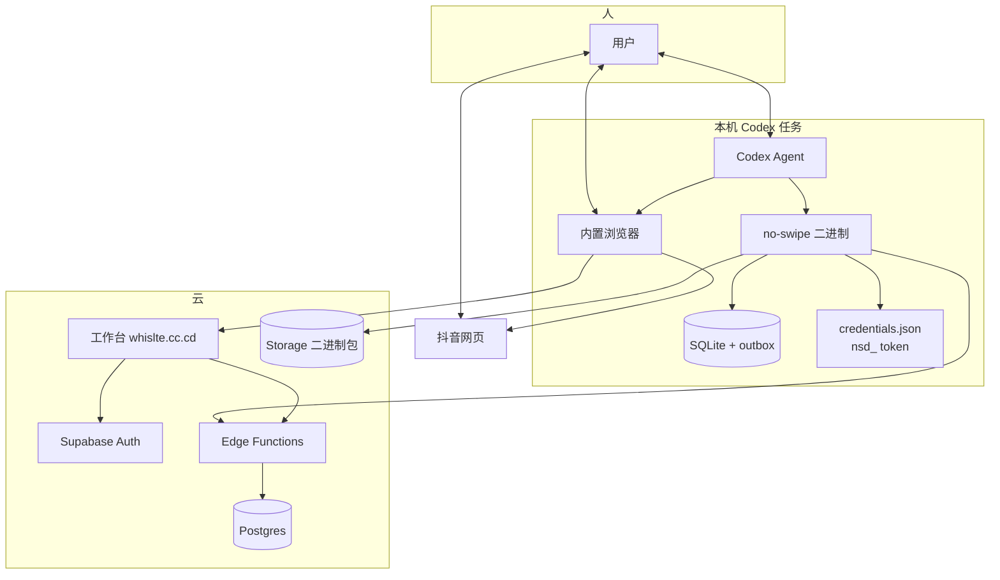
```mermaid
flowchart TB
  subgraph Human["人"]
    U[用户]
  end

  subgraph Host["本机 Codex 任务"]
    A[Codex Agent]
    B[内置浏览器]
    C["no-swipe 二进制"]
    S[(SQLite + outbox)]
    Cred["credentials.json<br/>nsd_ token"]
  end

  subgraph Cloud["云"]
    W["工作台 whislte.cc.cd"]
    Auth[Supabase Auth]
    EF[Edge Functions]
    PG[(Postgres)]
    ST[(Storage 二进制包)]
  end

  DY[抖音网页]

  U <--> A
  U <--> B
  U <--> DY
  A --> C
  A --> B
  B --> W
  B --> DY
  C --> S
  C --> Cred
  C --> EF
  C --> ST
  W --> Auth
  W --> EF
  EF --> PG
```

---

## 2. 凭证边界

谁拿什么，决定哪条线能写库。

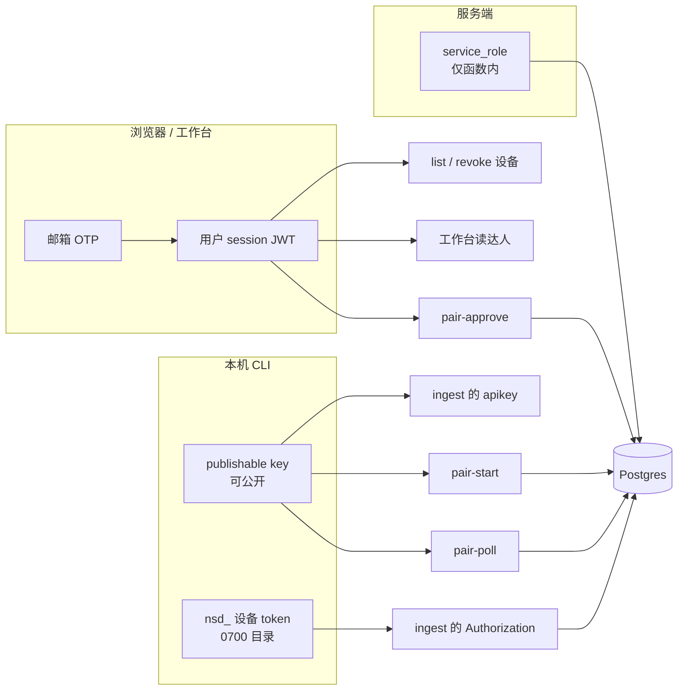
```mermaid
flowchart LR
  subgraph Browser["浏览器 / 工作台"]
    OTP["邮箱 OTP"] --> JWT["用户 session JWT"]
  end

  subgraph CLI["本机 CLI"]
    PK["publishable key<br/>可公开"]
    NSD["nsd_ 设备 token<br/>0700 目录"]
  end

  subgraph Server["服务端"]
    SR["service_role<br/>仅函数内"]
  end

  JWT --> PA["pair-approve"]
  JWT --> LD["list / revoke 设备"]
  JWT --> LA["工作台读达人"]
  PK --> PS["pair-start"]
  PK --> PP["pair-poll"]
  PK --> ING["ingest 的 apikey"]
  NSD --> ING2["ingest 的 Authorization"]
  SR --> DB[(Postgres)]
  PA --> DB
  PS --> DB
  PP --> DB
  ING2 --> DB
```

| 凭证 | 持有者 | 用途 |
|---|---|---|
| 邮箱 OTP → 用户 JWT | 工作台浏览器 | 登录、自动授权配对、吊销设备、读达人列表 |
| publishable key | 插件配置 / 二进制内置 | `pair-start`、`pair-poll`、ingest 的 `apikey` |
| `device_secret` | 仅 CLI 内存，配对期间 | `pair-poll` 证明「我是发起这对的那台机器」；库里只存 sha256 |
| `nsd_` device token | `~/.config/no-swipe/credentials.json` | ingest 上传；`auth status` 探活 |
| service_role | Edge Function / Worker | 写 `device_*` 与 `observations` |

工作台生产路径：`/pair` 用 `supabase.functions.invoke("pair-approve")` 直打 Edge Function（带用户 JWT）。Worker `/api` 里也有一份相同语义的实现，供本地夹具与 `/api/functions/v1/*` 使用。

ingest 仍接受旧 MCP 的用户 JWT（两周兼容）。新热路径只用 `nsd_`。

---

## 3. 一次完整任务：总览

用户对 Agent 说「刷推荐流」之后，skill 规定的顺序如下。浏览器动作必须排在上传授权之后。

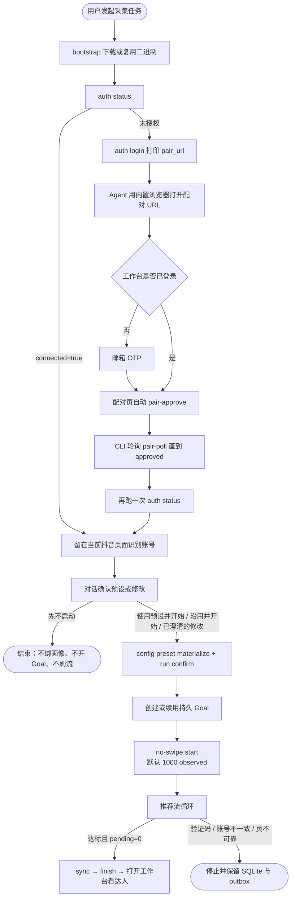
```mermaid
flowchart TD
  S([用户发起采集任务]) --> Boot[bootstrap 下载或复用二进制]
  Boot --> Status["auth status"]
  Status -->|connected=true| Identity[留在当前抖音页面识别账号]
  Status -->|未授权| Login["auth login 打印 pair_url"]
  Login --> OpenPair[Agent 用内置浏览器打开配对 URL]
  OpenPair --> OTP{工作台是否已登录}
  OTP -->|否| Mail[邮箱 OTP]
  Mail --> Auto[配对页自动 pair-approve]
  OTP -->|是| Auto
  Auto --> Poll["CLI 轮询 pair-poll 直到 approved"]
  Poll --> Status2["再跑一次 auth status"]
  Status2 --> Identity
  Identity --> Ask[对话确认预设或修改]
  Ask -->|先不启动| Stop([结束：不绑画像、不开 Goal、不刷流])
  Ask -->|使用预设并开始 / 沿用并开始 / 已澄清的修改| Mat["config preset materialize + run confirm"]
  Mat --> Goal[创建或续用持久 Goal]
  Goal --> Start["no-swipe start<br/>默认 1000 observed"]
  Start --> Loop[推荐流循环]
  Loop -->|达标且 pending=0| Fin["sync → finish → 打开工作台看达人"]
  Loop -->|验证码 / 账号不一致 / 页不可靠| Halt([停止并保留 SQLite 与 outbox])
```

人在这条链上只做三件事：确认（或改）预设、保证抖音已登录、必要时完成一次邮箱 OTP。配对码本身不要求再点一次「同意授权」。

---

## 4. 插件安装与二进制引导

插件壳随 Codex marketplace 进本机；采集器是另一个包，按 `cli-version.json` 钉死版本。

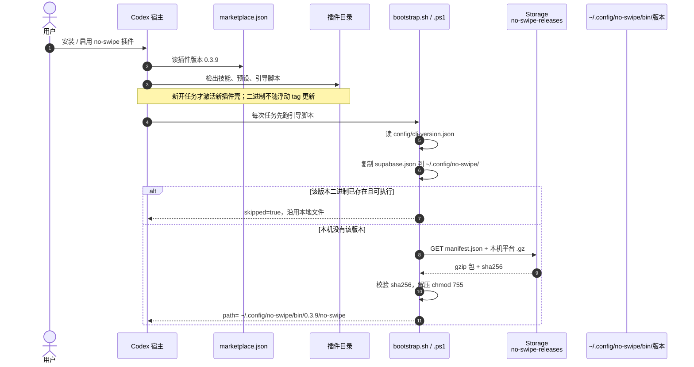
```mermaid
sequenceDiagram
  autonumber
  actor User as 用户
  participant Codex as Codex 宿主
  participant Mkt as marketplace.json
  participant Plug as 插件目录
  participant Boot as bootstrap.sh / .ps1
  participant Stor as Storage<br/>no-swipe-releases
  participant Disk as ~/.config/no-swipe/bin/版本

  User->>Codex: 安装 / 启用 no-swipe 插件
  Codex->>Mkt: 读插件版本 0.3.9
  Codex->>Plug: 检出技能、预设、引导脚本
  Note over Codex,Plug: 新开任务才激活新插件壳；二进制不随浮动 tag 更新

  Codex->>Boot: 每次任务先跑引导脚本
  Boot->>Boot: 读 config/cli-version.json
  Boot->>Boot: 复制 supabase.json 到 ~/.config/no-swipe/
  alt 该版本二进制已存在且可执行
    Boot-->>Codex: skipped=true，沿用本地文件
  else 本机没有该版本
    Boot->>Stor: GET manifest.json + 本机平台 .gz
    Stor-->>Boot: gzip 包 + sha256
    Boot->>Boot: 校验 sha256，解压 chmod 755
    Boot-->>Codex: path= ~/.config/no-swipe/bin/0.3.9/no-swipe
  end
```

平台：`darwin-arm64` / `darwin-x64` / `windows-x64`。Linux 不是发布目标。Windows 上 SmartScreen / 360 拦未签名 exe 是本机信任提示，不是改走 Node/Python 的信号。

Agent 随后固定环境变量：

- `NO_SWIPE_PLUGIN_ROOT` = 插件根目录  
- `NO_SWIPE` = 上面那个二进制路径  

---

## 5. 工作台邮箱登录

`/pair` 受登录保护。未登录时路由把 `redirect` 编进 `/login`。

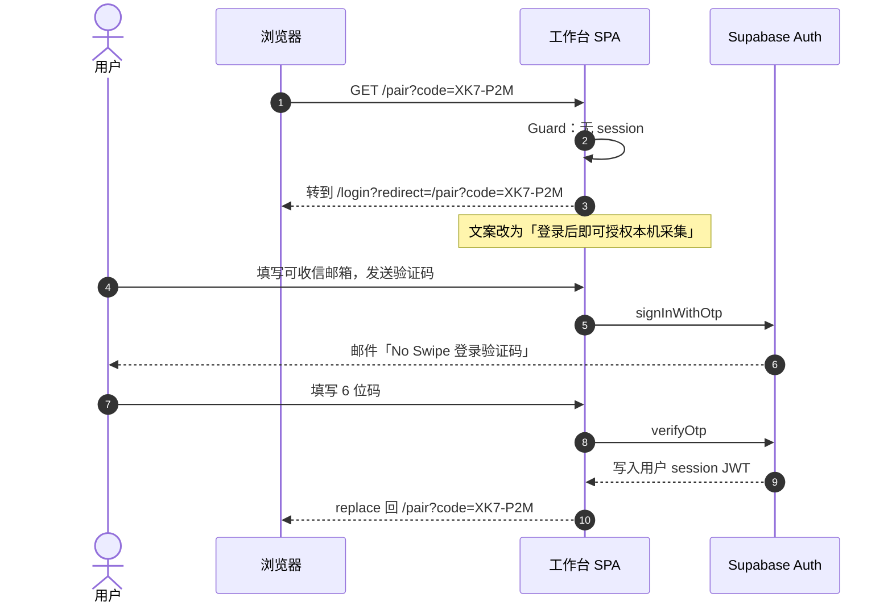
```mermaid
sequenceDiagram
  autonumber
  actor User as 用户
  participant Br as 浏览器
  participant WB as 工作台 SPA
  participant Auth as Supabase Auth

  Br->>WB: GET /pair?code=XK7-P2M
  WB->>WB: Guard：无 session
  WB-->>Br: 转到 /login?redirect=/pair?code=XK7-P2M
  Note over WB: 文案改为「登录后即可授权本机采集」

  User->>WB: 填写可收信邮箱，发送验证码
  WB->>Auth: signInWithOtp
  Auth-->>User: 邮件「No Swipe 登录验证码」
  User->>WB: 填写 6 位码
  WB->>Auth: verifyOtp
  Auth-->>WB: 写入用户 session JWT
  WB-->>Br: replace 回 /pair?code=XK7-P2M
```

开放注册：任意能完成 OTP 的邮箱即可。Agent 不代填、不索取 OTP 或邮箱密码。

---

## 6. 设备配对（主交互）

三步拆开：**本机申请码**、**已登录浏览器批准**、**本机兑 token**。批准和兑付必须是两台不同的调用方，避免 CLI 自己批准自己。

配对码格式 `A-Z2-9` 的 `XXX-XXX`，10 分钟过期。同一 IP 10 分钟内最多 20 次 `pair-start`。

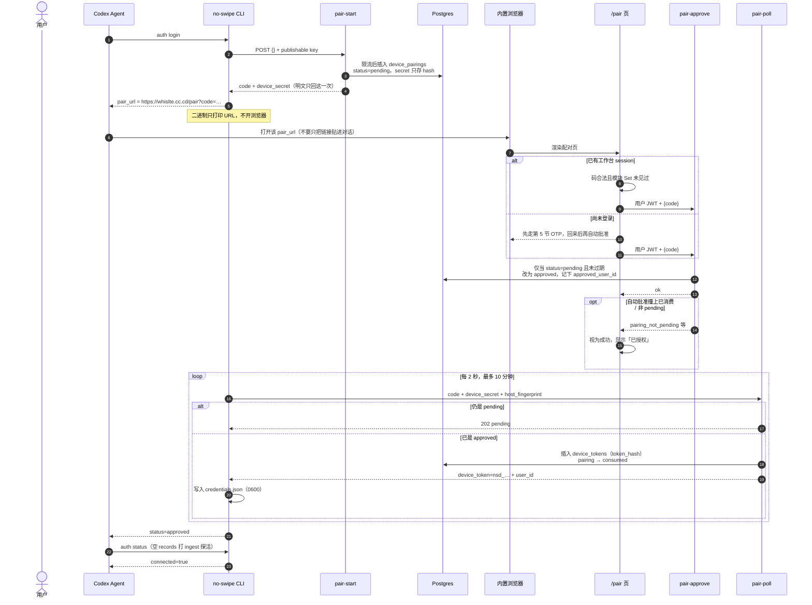
```mermaid
sequenceDiagram
  autonumber
  actor User as 用户
  participant Agent as Codex Agent
  participant CLI as no-swipe CLI
  participant PS as pair-start
  participant PG as Postgres
  participant Br as 内置浏览器
  participant Pair as /pair 页
  participant PA as pair-approve
  participant PP as pair-poll

  Agent->>CLI: auth login
  CLI->>PS: POST {} + publishable key
  PS->>PG: 限流后插入 device_pairings<br/>status=pending，secret 只存 hash
  PS-->>CLI: code + device_secret（明文只回这一次）
  CLI-->>Agent: pair_url = https://whislte.cc.cd/pair?code=…
  Note over CLI: 二进制只打印 URL，不开浏览器

  Agent->>Br: 打开该 pair_url（不要只把链接贴进对话）
  Br->>Pair: 渲染配对页

  alt 已有工作台 session
    Pair->>Pair: 码合法且模块 Set 未见过
    Pair->>PA: 用户 JWT + {code}
  else 尚未登录
    Pair-->>Br: 先走第 5 节 OTP，回来后再自动批准
    Pair->>PA: 用户 JWT + {code}
  end

  PA->>PG: 仅当 status=pending 且未过期<br/>改为 approved，记下 approved_user_id
  PA-->>Pair: ok

  opt 自动批准撞上已消费 / 非 pending
    PA-->>Pair: pairing_not_pending 等
    Pair->>Pair: 视为成功，显示「已授权」
  end

  loop 每 2 秒，最多 10 分钟
    CLI->>PP: code + device_secret + host_fingerprint
    alt 仍是 pending
      PP-->>CLI: 202 pending
    else 已是 approved
      PP->>PG: 插入 device_tokens（token_hash）<br/>pairing → consumed
      PP-->>CLI: device_token=nsd_… + user_id
      CLI->>CLI: 写入 credentials.json（0600）
    end
  end

  CLI-->>Agent: status=approved
  Agent->>CLI: auth status（空 records 打 ingest 探活）
  CLI-->>Agent: connected=true
```

自动授权细节：

- 路由能渲染 `/pair` 即表示已登录。URL 带合法码时 `useEffect` 直接 `pair-approve`。
- 模块级 `Set` 防止 React StrictMode 双挂载打两次。
- 「同意授权」按钮仍在，只作为自动批准报错时的回退。Agent **不问**用户有没有点按钮。

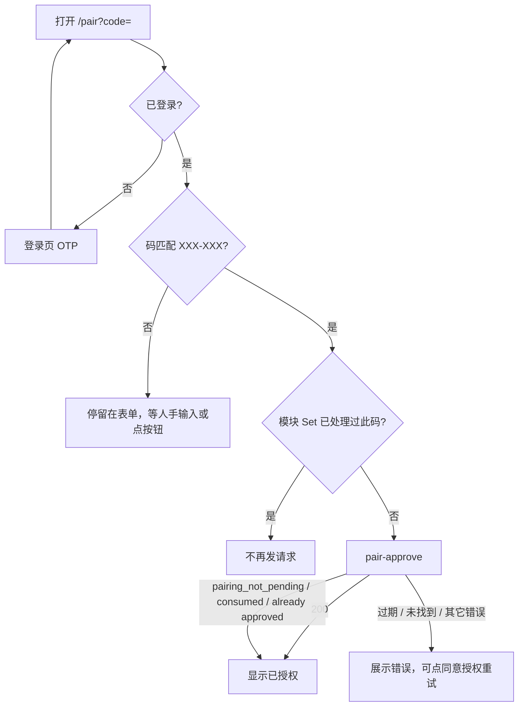
```mermaid
flowchart TD
  A[打开 /pair?code=] --> B{已登录?}
  B -->|否| C[登录页 OTP]
  C --> A
  B -->|是| D{码匹配 XXX-XXX?}
  D -->|否| E[停留在表单，等人手输入或点按钮]
  D -->|是| F{模块 Set 已处理过此码?}
  F -->|是| G[不再发请求]
  F -->|否| H[pair-approve]
  H -->|200| I[显示已授权]
  H -->|pairing_not_pending / consumed / already approved| I
  H -->|过期 / 未找到 / 其它错误| J[展示错误，可点同意授权重试]
```

---

## 7. 配对记录状态机

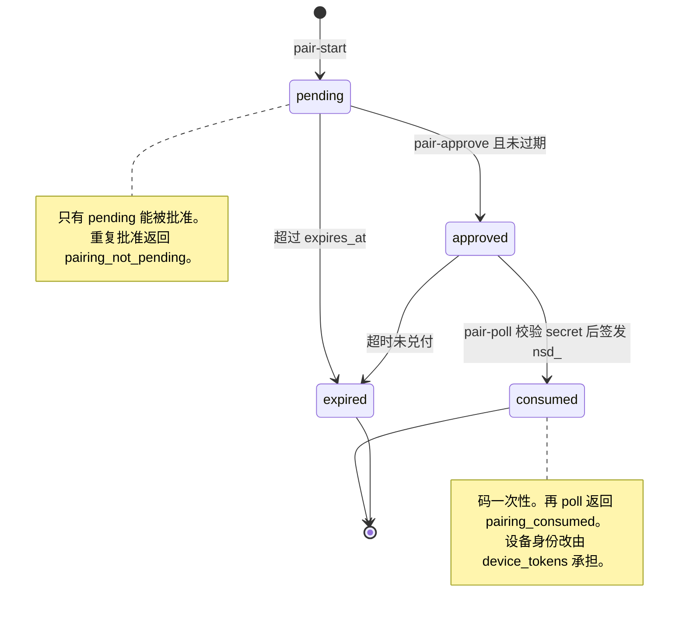
```mermaid
stateDiagram-v2
  [*] --> pending: pair-start
  pending --> approved: pair-approve 且未过期
  pending --> expired: 超过 expires_at
  approved --> consumed: pair-poll 校验 secret 后签发 nsd_
  approved --> expired: 超时未兑付
  consumed --> [*]
  expired --> [*]

  note right of pending
    只有 pending 能被批准。
    重复批准返回 pairing_not_pending。
  end note

  note right of consumed
    码一次性。再 poll 返回 pairing_consumed。
    设备身份改由 device_tokens 承担。
  end note
```

`device_tokens` 另有生命周期：签发 → `last_used_at` 随 ingest 更新 → 用户在账户菜单吊销（`revoked_at`）。吊销后 ingest 返回 `device_token_revoked`；本地 outbox 仍保留，待重新配对后再 `sync`。

---

## 8. 账号解析、预设确认、Goal

授权通过后，留在当前登录的抖音推荐流或现有页面。账号身份按三层阶梯解析：优先当前页面框架、账号菜单或登录账号头像区域的可见信息；页面看不到抖音号时，经可见入口（头像/账号菜单）打开**自己**的主页，只读昵称和抖音号，读完立即返回推荐流并确认推荐流已激活；两层都失败才在对话中请用户提供抖音号。内容卡片中的作者头像不属于认号入口；不得打开任何达人（作者）主页。首次绑定和每次新会话的换号检测走同一套阶梯：解析出的抖音号与已绑 account_ref 不一致即视为换号，切换到对应账号目录，不改旧画像。

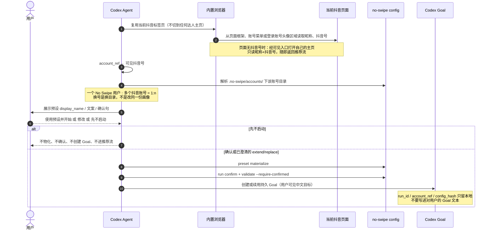
```mermaid
sequenceDiagram
  autonumber
  actor User as 用户
  participant Agent as Codex Agent
  participant Br as 内置浏览器
  participant DY as 当前抖音页面
  participant CLI as no-swipe config
  participant Goal as Codex Goal

  Agent->>Br: 复用当前抖音标签页（不切到任何达人主页）
  Br->>DY: 从页面框架、账号菜单或登录账号头像区域读取昵称、抖音号
  Note over Br,DY: 页面无抖音号时：经可见入口打开自己的主页<br/>只读昵称+抖音号，随即返回推荐流
  Agent->>Agent: account_ref ← 可见抖音号
  Agent->>CLI: 解析 .no-swipe/accounts/ 下该账号目录
  Note over Agent: 一个 No Swipe 用户 : 多个抖音账号 = 1:n<br/>换号是换目录，不是改同一份画像

  Agent->>User: 展示预设 display_name / 文案 / 确认句
  User-->>Agent: 使用预设并开始 或 修改 或 先不启动

  alt 先不启动
    Agent-->>User: 不物化、不确认、不创建 Goal、不进推荐流
  else 确认或已澄清的 extend/replace
    Agent->>CLI: preset materialize
    Agent->>CLI: run confirm + validate --require-confirmed
    Agent->>Goal: 创建或续用持久 Goal（用户可见中文目标）
    Note over Goal: run_id / account_ref / config_hash 只留本地<br/>不要写进对用户的 Goal 文本
  end
```

默认运行：`no-swipe start` → `target=1000`、`count_mode=observed`。相关条数模式需显式 `--relevant`。`--revision` 必须是正整数，不能靠 `Number("abc") === NaN` 绕过。

这一次对话确认同时授权后续点赞 / 收藏 / 不感兴趣 / 关注与评论**候选**。`profile_visit` / `profile_sampling` 即使出现在旧配置中也不授权主页跳转；刷流循环中不再逐条询问，配额里的 `confirmationRequired` 视为已满足。

---

## 9. 推荐流单条循环

浏览器由 Agent 驱动。CLI 的 `step` 只做分类 + 落库，不点页面。配额脚本决定互动计划；`plannedActions.follow` 在候选创作者上为 true。

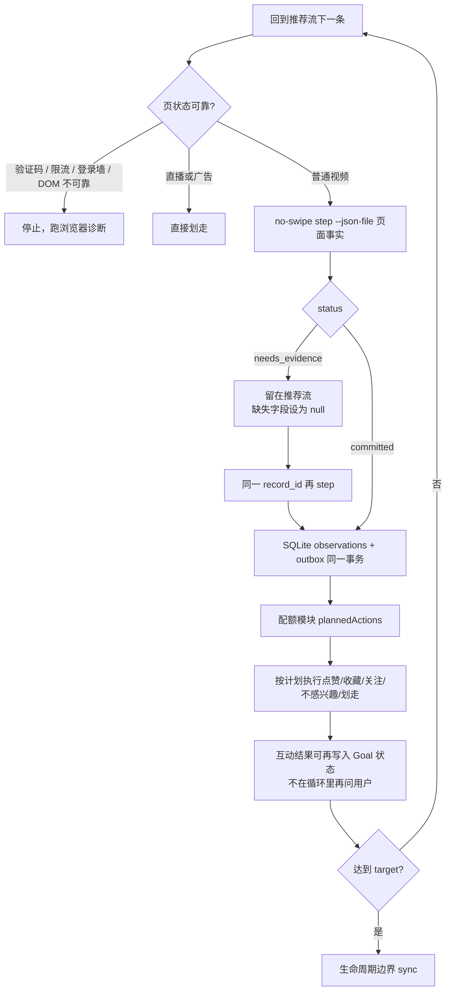
```mermaid
flowchart TD
  Start[回到推荐流下一条] --> Gate{页状态可靠?}
  Gate -->|验证码 / 限流 / 登录墙 / DOM 不可靠| Stop[停止，跑浏览器诊断]
  Gate -->|直播或广告| Skip[直接划走]
  Gate -->|普通视频| Classify["no-swipe step --json-file 页面事实"]

  Classify --> Need{status}
  Need -->|needs_evidence| Missing[留在推荐流<br/>缺失字段设为 null]
  Missing --> Classify2["同一 record_id 再 step"]
  Classify2 --> Commit
  Need -->|committed| Commit[SQLite observations + outbox 同一事务]

  Commit --> Quota[配额模块 plannedActions]
  Quota --> Act[按计划执行点赞/收藏/关注/不感兴趣/划走]
  Act --> PersistNote[互动结果可再写入 Goal 状态<br/>不在循环里再问用户]
  PersistNote --> Count{达到 target?}
  Count -->|否| Start
  Count -->|是| SyncB[生命周期边界 sync]
```

`step` 在证据不足时返回 `needs_evidence`。Agent 只采用当前推荐卡片已经可见的事实；缺失的粉丝数、近期作品稳定性或「是否新发」一律填 `null`，使用同一 `record_id` 再提交。不得猜测，也不得进入作者主页补证据。

短视频（预设：可靠测到 ≤60 秒）走立即车道：尝试「不感兴趣」，否则直接划走；不分配点赞、收藏、关注、完播。

安全停止页状态（配额配置）：`captcha`、`verification`、`rate_limited`、`access_restricted`、`login_required`、`unreliable_page`。

---

## 10. 本地持久化

热路径的事实源是 SQLite，不是 CSV。默认库路径：工作目录 `.no-swipe/runs/current/douyin_rpa_session.sqlite`。

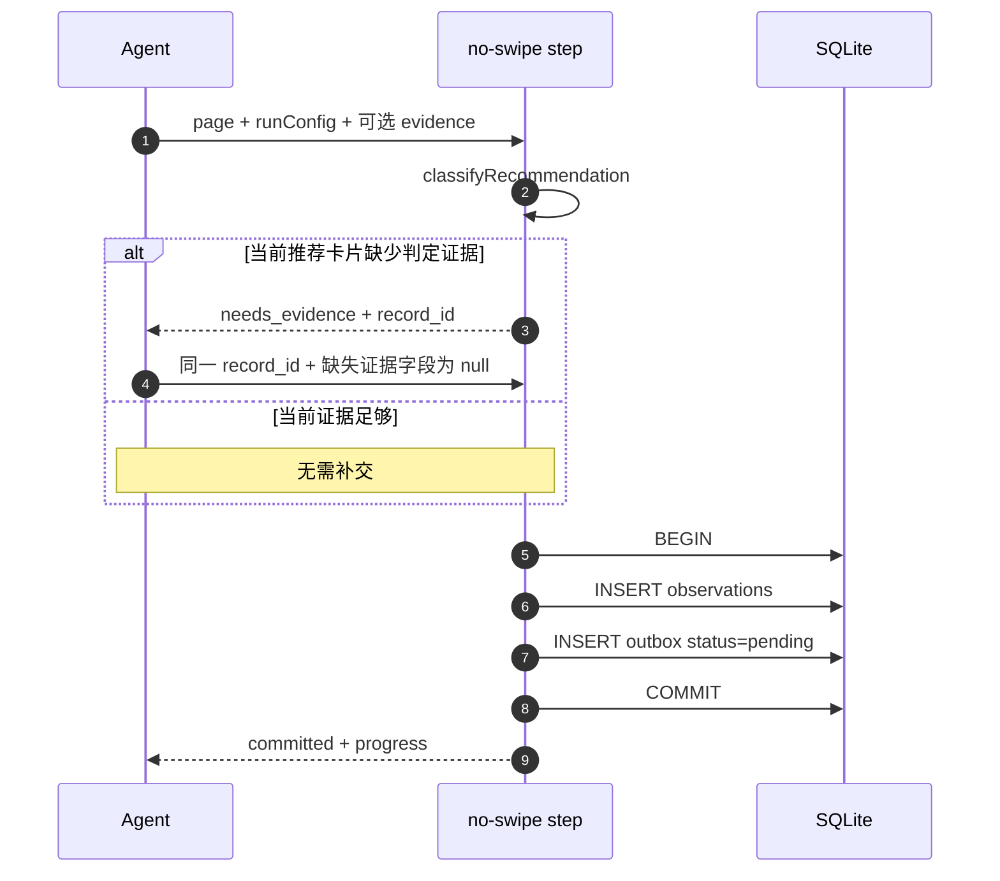
```mermaid
sequenceDiagram
  autonumber
  participant Agent as Agent
  participant Step as no-swipe step
  participant DB as SQLite

  Agent->>Step: page + runConfig + 可选 evidence
  Step->>Step: classifyRecommendation
  alt 当前推荐卡片缺少判定证据
    Step-->>Agent: needs_evidence + record_id
    Agent->>Step: 同一 record_id + 缺失证据字段为 null
  else 当前证据足够
    Note over Agent,Step: 无需补交
  end
  Step->>DB: BEGIN
  Step->>DB: INSERT observations
  Step->>DB: INSERT outbox status=pending
  Step->>DB: COMMIT
  Step-->>Agent: committed + progress
```

刷流循环**不等**远程 ingest。下一条可以立刻划。CSV / Excel 只在用户要看交付物时 `no-swipe export`。

Outbox 状态：

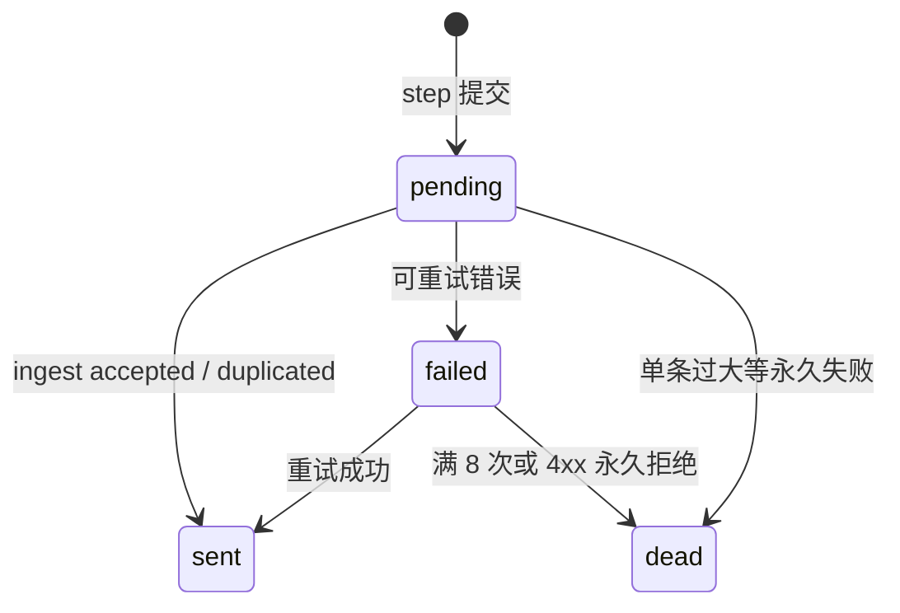
```mermaid
stateDiagram-v2
  [*] --> pending: step 提交
  pending --> sent: ingest accepted / duplicated
  pending --> failed: 可重试错误
  failed --> sent: 重试成功
  failed --> dead: 满 8 次或 4xx 永久拒绝
  pending --> dead: 单条过大等永久失败
```

`sync` 在暂停、页面异常、交接、结束时调用。Goal 完成前要求 `local.pending=0`；每条 `dead` 必须先人工看过。

---

## 11. 上传 ingest

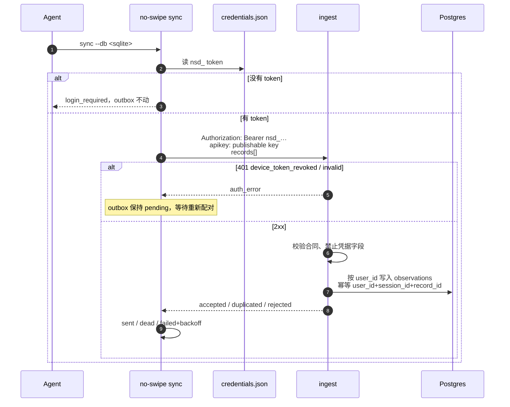
```mermaid
sequenceDiagram
  autonumber
  participant Agent as Agent
  participant Sync as no-swipe sync
  participant Cred as credentials.json
  participant Ing as ingest
  participant PG as Postgres

  Agent->>Sync: sync --db <sqlite>
  Sync->>Cred: 读 nsd_ token
  alt 没有 token
    Sync-->>Agent: login_required，outbox 不动
  else 有 token
    Sync->>Ing: Authorization: Bearer nsd_…<br/>apikey: publishable key<br/>records[]
    alt 401 device_token_revoked / invalid
      Ing-->>Sync: auth_error
      Note over Sync: outbox 保持 pending，等待重新配对
    else 2xx
      Ing->>Ing: 校验合同、禁止凭据字段
      Ing->>PG: 按 user_id 写入 observations<br/>幂等 user_id+session_id+record_id
      Ing-->>Sync: accepted / duplicated / rejected
      Sync->>Sync: sent / dead / failed+backoff
    end
  end
```

ingest 从 `nsd_` 的 `token_hash` 推出 `user_id`，并更新 `last_used_at`。工作台读 API **不**走 ingest。

---

## 12. 任务结束与工作台回看

配对成功时浏览器里已经是该用户的工作台 session，结束时不用再登一次。

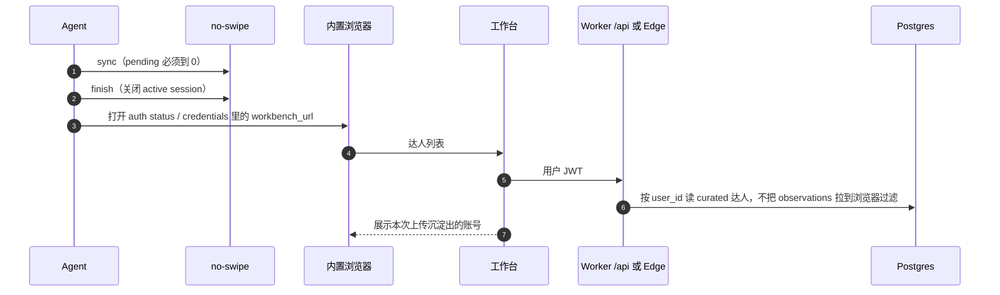
```mermaid
sequenceDiagram
  autonumber
  participant Agent as Agent
  participant CLI as no-swipe
  participant Br as 内置浏览器
  participant WB as 工作台
  participant API as Worker /api 或 Edge
  participant PG as Postgres

  Agent->>CLI: sync（pending 必须到 0）
  Agent->>CLI: finish（关闭 active session）
  Agent->>Br: 打开 auth status / credentials 里的 workbench_url
  Br->>WB: 达人列表
  WB->>API: 用户 JWT
  API->>PG: 按 user_id 读 curated 达人，不把 observations 拉到浏览器过滤
  WB-->>Br: 展示本次上传沉淀出的账号
```

---

## 13. 吊销设备

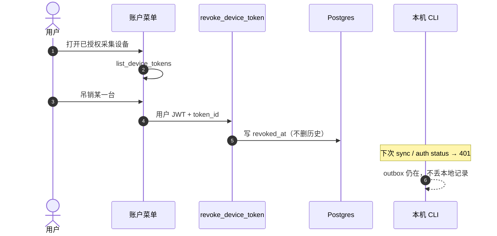
```mermaid
sequenceDiagram
  autonumber
  actor User as 用户
  participant WB as 账户菜单
  participant RV as revoke_device_token
  participant PG as Postgres
  participant CLI as 本机 CLI

  User->>WB: 打开已授权采集设备
  WB->>WB: list_device_tokens
  User->>WB: 吊销某一台
  WB->>RV: 用户 JWT + token_id
  RV->>PG: 写 revoked_at（不删历史）
  Note over CLI: 下次 sync / auth status → 401
  CLI-->>CLI: outbox 仍在，不丢本地记录
```

`auth logout` 只删本机 `credentials.json`，**不**吊销服务端 token。要从服务端断开，走工作台吊销。

---

## 14. 恢复任务

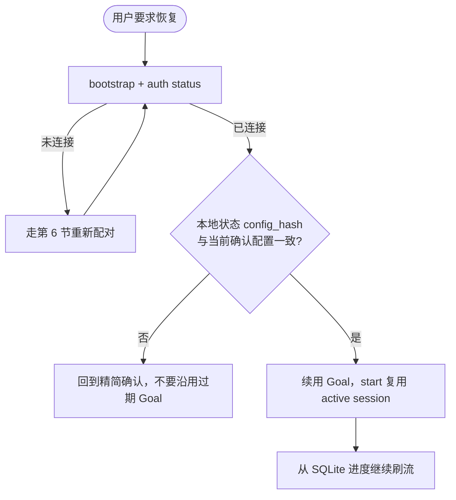
```mermaid
flowchart TD
  R([用户要求恢复]) --> Auth["bootstrap + auth status"]
  Auth -->|未连接| Pair[走第 6 节重新配对]
  Pair --> Auth
  Auth -->|已连接| Hash{本地状态 config_hash<br/>与当前确认配置一致?}
  Hash -->|否| Reask[回到精简确认，不要沿用过期 Goal]
  Hash -->|是| Cont[续用 Goal，start 复用 active session]
  Cont --> Loop[从 SQLite 进度继续刷流]
```

换一台电脑：没有 `nsd_`，必须重新配对。SQLite 不随账号云同步。

---

## 15. 浏览器异常

抖音按 SPA 控制：同一意图最多点击一次，不使用 `expectNavigation`；点击与 URL / 可见状态校验拆成独立的有界调用，只读取紧凑字段。页超时、`browser unavailable`、标签页失联、卡片不可靠或转场失败时，**先停刷流**，不盲目重试点击、不加载整份浏览器文档；复用同一 browser binding 和标签页，按 skill 的 `references/browser-diagnostics.md` 做同表面有界诊断。外开系统 Chrome 对比是可选项，不能用来证明内置浏览器已经恢复。

---

## 16. 发版（插件 + 二进制 + 工作台）

运行时自动更新拆成两段：插件壳靠 Codex marketplace 的 git 版本；二进制靠 `cli-version.json` + Storage 对象，引导脚本换包。用户和 Agent 都不执行 `marketplace upgrade`：新开任务即完成激活，引导脚本按钉死版本换包。

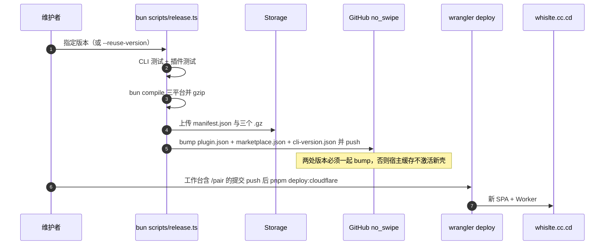
```mermaid
sequenceDiagram
  autonumber
  participant Dev as 维护者
  participant Rel as bun scripts/release.ts
  participant Stor as Storage
  participant Git as GitHub no_swipe
  participant WB as wrangler deploy
  participant CDN as whislte.cc.cd

  Dev->>Rel: 指定版本（或 --reuse-version）
  Rel->>Rel: CLI 测试 + 插件测试
  Rel->>Rel: bun compile 三平台并 gzip
  Rel->>Stor: 上传 manifest.json 与三个 .gz
  Rel->>Git: bump plugin.json + marketplace.json + cli-version.json 并 push
  Note over Git: 两处版本必须一起 bump，否则宿主缓存不激活新壳

  Dev->>WB: 工作台含 /pair 的提交 push 后 pnpm deploy:cloudflare
  WB->>CDN: 新 SPA + Worker
```

匿名可读 Storage，写入关闭。禁止用「latest」文件名覆盖而不改版本。工作台 `workers_dev: false`，只绑自定义域。

---

## 17. 人机分工一览

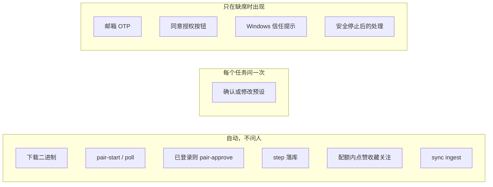
```mermaid
flowchart LR
  subgraph Auto["自动，不问人"]
    A1[下载二进制]
    A2[pair-start / poll]
    A3[已登录则 pair-approve]
    A4[step 落库]
    A5[配额内点赞收藏关注]
    A6[sync ingest]
  end

  subgraph Once["每个任务问一次"]
    H1[确认或修改预设]
  end

  subgraph Rare["只在缺席时出现"]
    H2[邮箱 OTP]
    H3[同意授权按钮]
    H4[Windows 信任提示]
    H5[安全停止后的处理]
  end
```

Agent **不要**做的事：向用户要 OpenAI Key、设备 token、OTP、邮箱密码；把 `run_id` / 路径 / hash 写进用户可见 Goal；打开自己或作者的创作者主页；在刷流循环里逐条确认关注；授权失败后仍去开抖音。

---

## 18. 关键 URL 与命令

| 动作 | 入口 |
|---|---|
| 配对页 | `https://whislte.cc.cd/pair?code=XXX-XXX` |
| 登录 | `https://whislte.cc.cd/login?redirect=…` |
| 申请码 | `POST …/functions/v1/pair-start` |
| 批准 | `POST …/functions/v1/pair-approve`（用户 JWT） |
| 兑付 | `POST …/functions/v1/pair-poll` |
| 上传 | `POST …/functions/v1/ingest`（`nsd_`） |
| 二进制 | `…/storage/v1/object/public/no-swipe-releases/<version>/` |

```text
"$NO_SWIPE" auth status
"$NO_SWIPE" auth login          # 打印 pair_url，然后 Agent 打开浏览器
"$NO_SWIPE" start               # 默认 1000 observed
"$NO_SWIPE" step --db <sqlite> --json-file <payload.json>
"$NO_SWIPE" sync --db <sqlite>
"$NO_SWIPE" finish --db <sqlite>
"$NO_SWIPE" export --db <sqlite>
```

---

## 修订

| 日期 | 版本 | 说明 |
|---|---|---|
| 2026-08-27 | 0.3.6 | 按已发布实现整理全链路交互：自动配对、observed 默认、配额 follow、Storage 分发 |
| 2026-08-27 | 0.3.7 | 静默自动更新：新开任务走 bootstrap，用户不再输入 upgrade 命令 |
| 2026-08-27 | 0.3.8 | 刷流与认号都不打开创作者主页，缺证据在推荐流上报空值 |
| 2026-08-28 | 0.3.9 | 引导脚本删除旧二进制和旧插件缓存；预设关闭主页访问 |
| 2026-08-28 | 0.4.0 | bootstrap 链式执行 no-swipe up，启动三次调用合并为一次 |
| 2026-08-29 | 0.4.1 | 认号阶梯：页面无抖音号时允许打开自己的主页读取后返回；达人主页维持禁止 |
