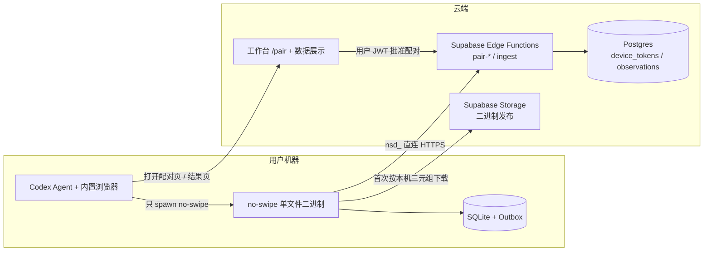
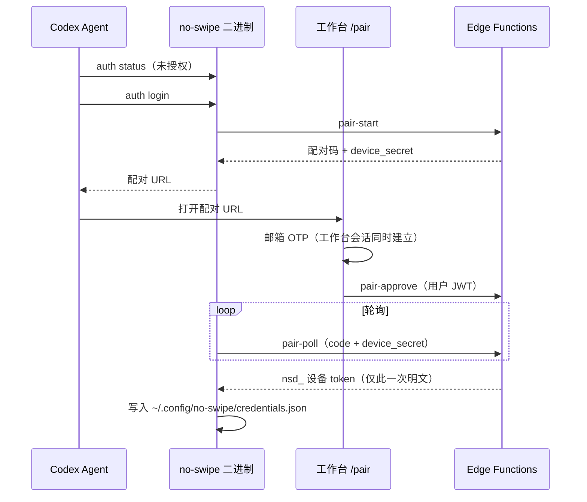

# No Swipe 去 MCP 化重构任务清单（v2）

日期：2026-08-24
状态：已评审，待执行

相对草稿的修正（必须按此执行，不要回退）：

- 本地库维持 SQLite，不改 JSONL
- 准入本期开放注册，不做邮箱域限制；未来收紧时只在 `pair-approve` 签发端加拦截即可
- ingest 的用户 JWT 只服务旧 MCP 两周，期满删除；工作台读 API 从不走 ingest
- 刷流 runner 必须打进同一二进制；否则「零 Node」不成立
- 默认插件包不再注册 `npx chrome-devtools-mcp`
- 权威服务端是仓库根目录 `supabase/`，不是 `no_swipe/supabase/`
- 安装命令不变；二进制按本机自动下载，用户不选平台
- Windows 真机通过才算出包完成，不是「先发 Mac」

## 背景与目标

现行方案把上传认证绑在 Codex 宿主的 MCP OAuth 上。订阅登录、API Key、三方中转行为不一致：API Key 不支持连接器式 OAuth；skill 里因此堆了 `codex mcp add/login`、安装 CLI / Python / uv 等补丁。插件与工作台还要各登录一次。

本次重构目标：

- 业务同学全流程只做一次人工认证（工作台配对页邮箱 OTP + 同意）
- 本机不要求预装 Node、Python、uv、Codex CLI，也不要求注册 MCP
- 订阅 / API Key / 中转站、Mac / Windows 走同一条路径
- 数据带 `user_id` 回传；配对成功后工作台已有会话，免二次登录
- 退役 Railway MCP，少一个部署目标

插件仍用现有 marketplace 安装。那两条命令只拉 skill 和引导脚本，不拉双平台二进制。

```bash
codex plugin marketplace add OfWind/no_swipe --ref main
codex plugin add no-swipe@no-swipe-marketplace
```

桌面端：Settings → Plugins → 添加同一 Git 市场 → 安装 No Swipe → **新开任务**。

## 已锁定决策

| 决策点 | 结论 |
| --- | --- |
| 认证 | 设备配对：工作台 `/pair`，签发上传专用设备 token（`nsd_` 前缀、库存哈希、可吊销） |
| 凭据 | `~/.config/no-swipe/credentials.json`（目录 `0700`、文件 `0600`），含设备 token 与工作台 URL。沿用现有 `~/.config/no-swipe/`，不用 `~/.no-swipe/` |
| 本地组件 | 一个 Bun 编译的单文件 `no-swipe`：`auth` / `config` / `collector` / `sync` / **刷流 step** |
| 本地数据库 | 保留 SQLite（`bun:sqlite`），沿用现有表结构与 CSV 字段；JSONL 以后再说 |
| 上传 | 二进制直连根目录 `ingest` Edge Function，不经 MCP / Railway |
| 刷流循环 | skill 只 spawn `no-swipe`，并用 Codex 内置浏览器。`createDouyinRunner()` / `node …mjs` / `python3` 全部退出热路径 |
| 二进制分发 | Supabase Storage 公共**只读** bucket；引导脚本按 `process.platform` + arch 下载一个包并校验 sha256 |
| 二进制缓存 | `~/.config/no-swipe/bin/<version>/`（跨插件升级可复用；版本变了再拉） |
| 出包平台 | `darwin-arm64` / `darwin-x64` / `windows-x64` 同时出包；Mac 先开发，**Windows 真机过了才能发** |
| 安装 | marketplace 命令与桌面端加市场不变；用户不选系统、不下手动 dmg/exe |
| 准入 | 本期开放注册，不限制邮箱域。未来收紧时只需在 `pair-approve` 签发端加允许名单（环境变量配置），`ingest` 以吊销机制兜底，无需改客户端 |
| 域名 | 工作台目标域 `fai.zhuanspirit.com/creators`（全部 URL 配置化，可一处替换）。**离开 `workers.dev` 是硬要求**；Cloudflare 绑自定义域不等于大陆能开。配对 API 与 ingest 已在 `supabase.co`，与数据面同通道 |
| 旧路径 | 硬切。存量 2–3 人口头通知；Railway `/mcp` 与 ingest JWT 上传各留两周后删除 |
| `.app.json` | 删除，不留第二条认证 |
| 默认 MCP | `.mcp.json` 去掉 `no-swipe` **和** `chrome-devtools`。诊断 reference 可保留，但不得注册 `npx` |

## 新架构



配对时序：



## 仓库边界

- **服务端权威源**：本仓库根目录 `supabase/migrations` 与 `supabase/functions/`。工作台、ingest、pairing 都部署在这里。
- **不要改** `no_swipe/supabase/functions/ingest` 当作生产入口。该副本本轮对齐后删除，或标明废弃，禁止两套并行修改。
- 插件权威源仍是 `no_swipe/plugins/no-swipe/`。
- 新 CLI 源码：`no_swipe/cli/`。

## Phase 1 — 服务端（根目录 `supabase/`）

1. **新增迁移**
   - `device_pairings`：`code`、`device_secret_hash`、`expires_at`（10 分钟）、`approved_user_id`、`status`（`pending` / `approved` / `consumed` / `expired`）
   - `device_tokens`：`id`、`token_hash`、`user_id`、`host_fingerprint`、`created_at`、`last_used_at`、`revoked_at`
   - RLS：用户只能读/吊销自己的 token；配对表不对客户端开放，仅 service role
2. **`pair-start`**：匿名 POST → 短配对码（如 `XK7-P2M`）+ `device_secret`，按 IP 限流
3. **`pair-approve`**：用户 JWT；校验码未过期；写入 `approved_user_id`。本期不做邮箱域校验；此处是未来收紧准入时的唯一拦截点（加环境变量允许名单即可，客户端无需改动）
4. **`pair-poll`**：`code + device_secret`；已批准则生成 32 字节 token，明文只返回一次，库存哈希，配对标记 `consumed`
5. **改根目录 `supabase/functions/ingest/index.ts`**
   - Bearer 以 `nsd_` 开头：查 `device_tokens` 哈希 → `user_id`，拒吊销，更新 `last_used_at`，调用 `ingest_observation_batch`。ingest 侧的准入守卫 = 校验 `revoked_at`（需要封禁某用户时吊销其全部 token 即可），不回查 `auth.users`
   - 原 Supabase JWT 上传路径**只留两周**给旧 MCP；工作台 list/get/review **继续用用户 JWT**，与 ingest 无关
   - 两周后删除 ingest 的 JWT 上传分支
6. **单测**：pair-start / pair-approve / pair-poll / ingest 设备 token；配对码过期、device_secret 不匹配、吊销后 401。沿用 `index_test.ts` 的依赖注入风格

## Phase 2 — 工作台（`apps/workbench`）

7. **`/pair`**：未登录走现有 OTP（`src/features/auth-session`）。登录后展示配对码 +「同意授权」→ `pair-approve`。成功后提示回到 Codex。本期开放注册（`shouldCreateUser: true`）
8. **已授权设备**：账号菜单或设置页列出本人 `device_tokens`（`host_fingerprint`、创建/最近使用）+ 吊销
9. **privacy / terms**：`no_swipe/mcp-server/public` 迁到工作台 `/privacy`、`/terms`
10. **URL 配置化**：工作台 origin、ingest、pair、二进制下载基址一处可换。当前工作台域 `fai.zhuanspirit.com/creators`。插件读 `no_swipe/plugins/no-swipe/config/supabase.json`（可增 `workbench_url` / `releases_base_url`）

## Phase 3 — `no-swipe` 单文件 CLI（`no_swipe/cli/`，Bun + TypeScript）

11. **脚手架 + config**：移植 `runtime/src/cli.mjs` 与 `config.mjs` 为 `no-swipe config ...`，JSON 字段与现 skill 契约一致
12. **collector**：以 `douyin_rpa_collector.py` 与 `collector/outbox.py` 为准，`bun:sqlite` 沿用表结构与 `CSV_FIELDS`；实现 `start / record / status / finish / export`。已有 `douyin_rpa_session.sqlite` 可直接续用
13. **`auth`**
    - `login`：pair-start → 打印配对 URL（agent 负责打开）→ 轮询 pair-poll → 写 `~/.config/no-swipe/credentials.json`；上报 `host_fingerprint`
    - `status`：本地凭据 + 对 ingest 做一次轻量校验
    - `logout`：删本地凭据
14. **`sync`**：outbox 直连 POST ingest（批 ≤100，按 `accepted` / `duplicated` ack），移植 `uploader.py` 的重试 / 退避 / dead。**删除** `mcp-next` / `mcp-ack` / MCP 工具
15. **刷流 step（零 Node 的关键）**：把 `douyin_browser_runner.mjs` 的 `processOne` 语义收成 `no-swipe step`（或等价子命令）。stdin/参数接收本条页面事实与已确认 RunConfig，stdout 返回决策与落盘结果；SQLite/outbox 在二进制内同一事务提交。agent 只操 Codex 浏览器 + spawn `no-swipe`。不要保留「agent 去 `import` runner.mjs」
    - **证据两阶段协议**（替代进程内 `resolveProfileEvidence` 回调）：`step` 判定为高相关候选且当前推荐卡片缺少证据时，不落盘、返回 `status=needs_evidence` 及所需字段（`creatorFollowerCount`、`creatorRecentLikesStable`、`isRecentlyPublished`）；agent 保持在推荐流，只传入当前卡片可见事实，缺失字段设为 `null`，再携带同一 `record_id` 重调 `step` 完成决策与落盘。不得猜测，不得打开自己或作者的创作者主页。早期计划中的主页取证路径自 0.3.8 起废弃
16. **测试**：bun test 等价重写 `tests/collector/`，并补 step 契约测试（与现 runner 的停止/落盘语义对齐）

## Phase 4 — 打包与分发

17. **构建**：`bun build --compile` 出 darwin-arm64 / darwin-x64 / windows-x64 + sha256 `manifest.json`。版本写入 `plugins/no-swipe/config/cli-version.json`，与插件版本联动
18. **发布**：上传 Storage `no-swipe-releases/<version>/`。bucket **匿名只读、写入关闭**；对象键带版本，禁止覆盖最新文件名而不改版本
19. **引导脚本**：`bootstrap.sh` + `bootstrap.ps1` 随插件分发。检测 `uname` / `$env:PROCESSOR_ARCHITECTURE` → curl 下载（macOS / Win10+ 自带）→ sha256 → 落入 `~/.config/no-swipe/bin/<version>/`。版本一致则跳过。skill 只调对应脚本，用户不选包
20. **Windows**：发布说明写清未签名 exe 可能被 SmartScreen / 360 拦截；正式对外前尽量代码签名。未签名不得当作「安装失败」让 skill 去装 CLI
21. **自动更新与发版流程**：插件壳依赖 Codex 官方机制——2026-04 起 Codex 对"configured Git marketplace"在插件启动/列表刷新时后台 `git ls-remote` 比对并**原子激活**新版本（openai/codex#17425），用户零操作，新开任务生效；桌面端 Ctrl+U / `codex plugin marketplace upgrade` 为手动兜底。二进制不做浮动更新，由 `config/cli-version.json` 钉死版本+sha256，随插件壳成对升级，引导脚本比对后自动换包。**发版纪律**：每次发布必须同时 bump `plugin.json` 与 `marketplace.json` 版本号（marketplace 靠 `version` 判断更新、缓存按版本目录激活，版本不 bump 会出现"推了代码行为没变"）。固定四步发版清单（可做成 CI 脚本）：bump 两处版本 → 更新 `cli-version.json` → 上传二进制到 Storage → push main

## Phase 5 — 插件与 skill（`no_swipe/plugins/no-swipe`）

21. **manifest**：删 `.app.json` 及 `plugin.json` 的 `apps`；`.mcp.json` 清空或删除（含 chrome-devtools）；homepage / websiteURL / privacy / terms 换工作台域；版本 bump
22. **接线**：删除 `collector_client.mjs` 对 python3 的 spawn。skill 与任何残留脚本只调用 `no-swipe`。`douyin_browser_runner.mjs` 在 step 子命令验收后删除，不「本体不动」
23. **SKILL.md**
    - 第 0 步：跑本机对应引导脚本 + `no-swipe auth status`；未授权则 `auth login`，打开配对页，等 OTP + 同意后重试
    - 删全部 `codex mcp add/get/list/login`、python、uv、`get_upload_status`、`ingest_observation_batch`
    - `node runtime/src/cli.mjs` 改为 `no-swipe config`
    - 刷流改为浏览器工具 + `no-swipe step`；上传改为 `no-swipe sync`
    - 完成条件仍是 `local.pending=0`，dead 逐条审查
    - 结束后打开工作台（配对时已建立会话）
24. **删除**：Python collector（`douyin_rpa_collector.py`、`scripts/collector/`）、旧 `runtime/` Node CLI、runner.mjs（step 落地后）

## Phase 6 — 下线与验收

25. **下线 Railway**：通知存量 2–3 人升级；`/mcp` 保留两周后关停；删除 `no_swipe/mcp-server`；同时删 ingest JWT 上传分支
26. **验收**（Mac 与 Windows 各一台干净机器，只装 ChatGPT 桌面端，API Key 登录；订阅再走一遍）
    - marketplace / 桌面插件安装 → 新开任务 → 自动下载**本机**那一个二进制，不出现另一平台包
    - 一次配对后 `auth status` 通过；工作台已登录
    - 确认预设 → 刷流 → 每条先落盘 → `no-swipe sync` 至 `local.pending=0`
    - 工作台能看到本次数据，且 `user_id` 正确
    - 吊销该设备后 `sync` 被拒，本地 outbox 仍在
    - 机器上没有 `node` / `python3` / `codex` CLI 也能跑完上述路径
    - Windows 未因杀毒/SmartScreen 导致 skill 改走安装补丁

## 任务总表

| # | 任务 | 阶段 |
| --- | --- | --- |
| 1 | 根目录迁移：device_pairings + device_tokens + RLS | 1 |
| 2 | pair-start / pair-approve / pair-poll 及单测 | 1 |
| 3 | ingest 支持 `nsd_`；JWT 上传标为两周兼容 | 1 |
| 4 | 工作台 `/pair`（复用 OTP，开放注册） | 2 |
| 5 | 工作台设备列表 + 吊销 | 2 |
| 6 | privacy/terms 迁工作台；URL 配置化 | 2 |
| 7 | `no_swipe/cli`：移植 config 子命令 | 3 |
| 8 | collector TS + bun:sqlite（沿用 schema / CSV 字段） | 3 |
| 9 | auth login/status/logout | 3 |
| 10 | sync 直连上传（重试/退避/dead） | 3 |
| 11 | `no-swipe step` 承接 runner 落盘与决策契约 | 3 |
| 12 | bun test 重写 collector 与 step 测试 | 3 |
| 13 | 三平台 compile + sha256 manifest + 只读 Storage | 4 |
| 14 | bootstrap.sh / bootstrap.ps1 按本机自动下载 | 4 |
| 14a | 发版脚本：bump 双版本号 + cli-version + 上传二进制 + push（自动更新链路） | 4 |
| 15 | 插件去掉 `.app.json`、全部默认 MCP、换域名、bump | 5 |
| 16 | 重写 SKILL.md；删除 python / runtime CLI / runner.mjs | 5 |
| 17 | 废弃或删除 `no_swipe/supabase` 副本 | 5 |
| 18 | 通知存量用户；两周后关 Railway 并删除 ingest JWT 上传 | 6 |
| 19 | 双平台干净机器全流程验收（含吊销、无 Node） | 6 |
